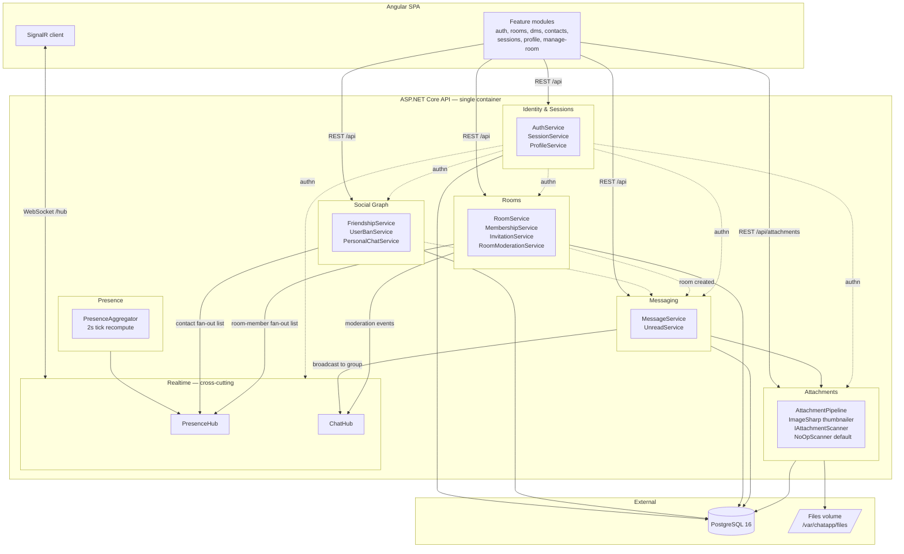

# Architecture — Online Chat Server

## Context

The product spec (`00-product-spec.md`) fixes the functional scope and the top-level technology choices. This document fills in the architectural shape below that: bounded contexts, process topology, runtime model, and the decisions that deviate from the spec after an MVP-vs-over-engineering pass.

The target envelope is **300 concurrent users on a single API container**. Everything here is optimised for that envelope; the "Scale-out path" section lists the interfaces kept clean so a later multi-instance deployment (Redis backplane + distributed presence) is mechanical rather than structural.

## Decisions vs. spec

| Area | Spec said | Architecture says | Why |
|---|---|---|---|
| Projects | 3-project clean arch | **4 projects**: `ChatApp.Api`, `ChatApp.Domain`, `ChatApp.Data`, `ChatApp.Tests` | Tests project carved out to keep Api/Domain/Data production-only. |
| Service location | Services in `ChatApp.Domain` | **Service implementations live under `ChatApp.Data/Services/*`**; `ChatApp.Domain` holds abstractions, enums, and pure helpers | Pragmatic: most services are thin wrappers around `ChatDbContext`; keeping them with the data layer avoids an anaemic Domain and a blizzard of repository interfaces. Infra pieces with no persistence (`PresenceAggregator`, image processors, broadcaster) live in `ChatApp.Api/Infrastructure/`. |
| SignalR hubs | Presence + Chat + possibly Moderation | **2 hubs: `PresenceHub`, `ChatHub`** | Moderation events are just state changes on rooms — fold into `ChatHub` groups. |
| ClamAV | Sidecar, blocking scan per upload | **Included as optional sidecar.** `IAttachmentScanner` with `ClamAvScanner` (default) and `NoOpScanner`, selected via `ChatApp:Attachments:Scanner` | Full implementation is wired, but the stack can run without the AV container by toggling config — useful for dev, CI, and the MVP envelope. |
| Password hash | Argon2id (Konscious) | **ASP.NET Core `PasswordHasher` (PBKDF2)** | Zero deps, audited, adequate at this scale. |
| Sessions | Custom table + `sha256(cookie)` | Kept | Sessions screen (list UA/IP/last-seen + revoke) requires server-side state. |
| Presence | 20s heartbeat + server aggregation | Kept | Deterministic, matches spec. |
| Image thumbs | 512px longest side, JPEG q80 | Same, via **SixLabors.ImageSharp** | Pure managed; no native Docker deps. |
| Scale-out | not stated | **Single instance**; interfaces ready for Redis | Matches load target; avoids premature infra. |
| Message send | not stated | **REST POST** then hub broadcasts | Single write path; auth / validation / rate-limit / logging land once. |
| Angular state | not stated | **Signals + feature services** | Lower ceremony; Angular 17+ idiom. |
| EF migrations | not stated | `db.Database.Migrate()` on startup | Single instance → no race. |
| Rate limits | Spec values unchanged | `AddRateLimiter` for REST; token bucket for hub | Built-in covers the important cases because message-send is REST. |

## Solution layout

```
server/
  ChatApp.sln
  Directory.Build.props     TreatWarningsAsErrors=true, Nullable=enable, net10.0
  global.json               .NET SDK pinned to 10.0.100 (latestFeature)
  ChatApp.Api/
    Program.cs              DI, auth, CSRF, rate limiters, SignalR, health checks
    Controllers/
      Auth/                 AuthController
      Users/                ProfileController, UserSearchController
      Sessions/             SessionsController
      Social/               FriendshipsController, BansController
      Rooms/                RoomsController, InvitationsController, ModerationController
      Messages/             RoomMessagesController, PersonalMessagesController,
                            MessagesController (edit/delete), UnreadController
      Attachments/          AttachmentsController
    Hubs/                   PresenceHub.cs, ChatHub.cs
    Infrastructure/         SessionAuthenticationHandler, CSRF middleware,
                            ChatBroadcaster, PresenceAggregator / PresenceTickService,
                            LoginRateLimiter, HubRateLimiter, image processors,
                            ProblemDetails / error handling, AttachmentPurger,
                            SoftDeletedRoomPurger
  ChatApp.Domain/           abstractions (IAttachmentScanner, IPresenceStore,
                            ICurrentUser, image-processor interfaces),
                            enums, pure helpers (PresenceAggregation logic,
                            RoomPermission rules)
  ChatApp.Data/
    ChatDbContext.cs        single context, UseSnakeCaseNamingConvention
    Entities/, Configurations/, Migrations/
    Services/               AuthService, SessionLookupService, SessionQueryService,
                            SessionRevocationService, ProfileService,
                            AccountDeletionService, FriendshipService,
                            UserBanService, PersonalChatService, RoomService,
                            RoomPermissionService, InvitationService,
                            ModerationService, MessageService, UnreadService,
                            AttachmentService, NoOpScanner, ClamAvScanner
  ChatApp.Tests/            xUnit — Unit/ (permission matrix, presence aggregation,
                            MIME sniff) + Integration/ (Testcontainers Postgres +
                            WebApplicationFactory)

client/                     Angular 19 standalone workspace
  src/app/
    core/                   auth (guard, service, models), http (credentials,
                            CSRF, error interceptors), signalr, messaging,
                            presence, rooms, social, sessions, profile, users,
                            notifications, context, layout, theme
    features/               auth, app-shell, rooms, dms, contacts, sessions,
                            profile, manage-room
    shared/                 ui, pipes, messaging
  e2e/                      Playwright (auth, messaging, attachments, presence)

infra/
  docker-compose.yml        services: db, api, web, clamav (clamav is optional —
                            swap scanner config to noop to run without it)
  Dockerfile.api            multi-stage .NET 10 build
  Dockerfile.web            Angular build → nginx
  nginx.conf                static bundle, /api + /hub reverse proxy, CSP + headers
```

## Bounded contexts

Six bounded contexts inside the API, two cross-cutting surfaces (Identity authn, Realtime delivery), and two external dependencies (Postgres, Filesystem).



### Context responsibilities

**Identity & Sessions** — registration, login, logout, password change, session list/revoke, profile (display name, avatar, sound toggle), account soft-delete. Owns `User`, `Session`. Provides `ICurrentUser` to every other context for authz.

**Social Graph** — friend requests, friendship lifecycle, user-to-user bans, personal chats. Owns `Friendship`, `UserBan`, `PersonalChat`. Accepting a friendship auto-creates the `PersonalChat`. Active `UserBan` is consulted by Messaging on DM writes and by Rooms on invitations.

**Rooms** — room CRUD, membership, invitations, room bans, moderation, capacity enforcement, catalog/search, audit log. Owns `Room`, `RoomMember`, `RoomBan`, `RoomInvitation`, `ModerationAudit`. Authoritative source for permission checks on room-scoped messaging.

**Messaging** — room + personal messages, edit/delete, replies, pagination, unread markers. Owns `Message`, `UnreadMarker`. Scope resolution (`room` vs `personal`) delegates permission to Rooms or Social respectively.

**Attachments** — upload pipeline (size cap → magic-byte MIME sniff → `IAttachmentScanner` hook → thumbnail via ImageSharp → persist), authorised download/preview endpoints. Owns `Attachment` and filesystem layout under `/var/chatapp/files/{yyyy}/{mm}/{uuid}{.ext}`.

**Presence** — heartbeat ingestion, per-user state aggregation across tabs, fan-out list resolution. Publishes `online | afk | offline` transitions via PresenceHub, broadcast only to the target user's contacts and room-mates.

**Realtime (cross-cutting)** — two SignalR hubs:
- `PresenceHub`: client → `Heartbeat(isActive)`; server → `PresenceChanged(userId, state)`. Heartbeats are gated by `HubRateLimiter` to shed misbehaving clients.
- `ChatHub`: server → `MessageCreated`, `MessageEdited`, `MessageDeleted`, `RoomMemberChanged`, `RoomBanned`, `ModerationAction`, `UnreadChanged`. Groups: `room:{roomId}`, `pchat:{personalChatId}`, `user:{userId}`. The hub exposes group-join/leave helpers only — **no** message write methods. All fan-out goes through `ChatBroadcaster` (registered singleton, wraps `IHubContext<ChatHub>`) so controllers and services have a single seam.

## Runtime model

### HTTP + WebSocket topology

```
Angular SPA ──► nginx ──► ASP.NET Core ──► Postgres
                              │
                              └── Filesystem (files volume)

WebSocket: SPA ──► nginx (upgrade) ──► ASP.NET Core (PresenceHub | ChatHub)
```

One process owns authoritative state. SignalR groups are in-process and are the source of truth for fan-out. No backplane.

### Message send sequence

1. Client `POST /api/chats/{scope}/{scopeId}/messages` with `{ body, reply_to_id?, attachment_ids? }`.
2. Controller: authz via Rooms (room scope) or Social (personal scope); rate limit; validate body ≤ 3 KB; verify attachments are owned by the caller and still unlinked.
3. Insert `Message`; link attachments (FK flip).
4. Resolve SignalR group (`room:{id}` or `pchat:{id}`); broadcast `MessageCreated` with the persisted row.
5. `UnreadService` increments `UnreadMarker` for all other recipients and emits `UnreadChanged` to each recipient's `user:{id}` group.

Edit and delete follow the same shape with `MessageEdited` / `MessageDeleted`.

### Attachment flow

1. `POST /api/attachments` (multipart). Kestrel enforces size limits.
2. Magic-byte sniff; reject if the claimed kind doesn't match bytes.
3. `IAttachmentScanner.ScanAsync(stream)` — `NoOpScanner` default; future `ClamAvScanner` impl registered via DI without changing the pipeline.
4. For images: ImageSharp resize to longest-side 512, JPEG q80, saved as `{stored_path}.thumb.jpg`.
5. Persist `Attachment` with `message_id = null` (unattached). Return id.
6. Client includes `attachment_ids` in the subsequent `POST messages` call, which sets the FK.
7. Background service purges unlinked attachments older than 1 hour.

### Presence flow

- Tab connects `PresenceHub` → `OnConnectedAsync` adds the connection to `user:{userId}` and registers it with `PresenceAggregator`.
- Tab calls `Heartbeat(isActive)` every 20 s. Aggregator updates per-connection `lastActiveAt` and `isActive`.
- A 2 s tick recomputes user state: any connection active within 60 s → `online`; connections exist but all inactive → `afk`; no connections → `offline`. Transitions broadcast to the union of the user's contacts and every room they belong to.

### Auth flow

- Login → PBKDF2 compare (`PasswordHasher<User>`) → generate 32-byte token → store `sha256(token)` in `Session` → set `HttpOnly; Secure; SameSite=Lax` cookie. Login is additionally gated by `LoginRateLimiter` (per-IP + per-email buckets per spec §3).
- Authentication is implemented as a custom auth scheme, `SessionAuthenticationHandler`, rather than the built-in cookie handler — it reads the cookie, delegates to `SessionLookupService` (30 s `IMemoryCache` hit; miss falls through to `ChatDbContext`), and attaches a `ClaimsPrincipal`. `last_seen_at` is updated fire-and-forget.
- SignalR uses the same cookie; `OnConnectedAsync` re-checks the session through the same path so revocation is honoured on reconnect.
- CSRF: double-submit token via custom middleware on non-GET REST; SignalR is cookie + Origin checked. Reverse-proxy scheme/IP are recovered via `UseForwardedHeaders` so `Secure` cookies and logged IPs are correct behind nginx.

## Data ownership

Single shared `ChatDbContext` for pragmatic reasons (one migrations history). Context boundaries are enforced at the **service layer**, not the DbContext — cross-context reads go through services, not direct entity queries.

| Tables | Owning context |
|---|---|
| `users`, `sessions` | Identity |
| `friendships`, `user_bans`, `personal_chats` | Social |
| `rooms`, `room_members`, `room_bans`, `room_invitations`, `moderation_audit` | Rooms |
| `messages`, `unread_markers` | Messaging |
| `attachments` | Attachments |

## Non-functional notes

- **Security**: PBKDF2 password hashing, HttpOnly+Secure cookies, SameSite=Lax, double-submit CSRF on non-GET, EF Core parameterised queries, authn on all upload/download endpoints, magic-byte MIME sniff, `X-Content-Type-Options: nosniff`, `Content-Disposition: attachment` on file downloads, CSP + security headers in nginx, rate limits per spec (REST via `AddRateLimiter` — named policies `"login"`, `"messages"`, `"uploads"`, `"general"`; login via `LoginRateLimiter`; hub via `HubRateLimiter`). The `"general"` anti-spam policy (60 burst, 1/s refill, per-user) guards write surfaces not covered by `"messages"` or `"uploads"` — friendships, invitations, moderation, room bans, profile edits, and message edit/delete. **No self-service password reset** — a forgot-password flow is TBD (see product spec §3).
- **Observability**: Serilog structured logging → stdout with request logging. All moderation writes a `ModerationAudit` row. SignalR connect/disconnect logged at Information. `/health` endpoint reports DB and (when enabled) ClamAV liveness. RFC 7807 `ProblemDetails` for error responses.
- **Performance**: keyset pagination on messages (`WHERE (created_at, id) < (@c, @i) ORDER BY created_at DESC, id DESC LIMIT 50`). Client virtualises via Angular CDK `cdk-virtual-scroll-viewport`. Targets: message p95 < 3 s, presence p95 < 2 s.
- **Persistence**: indefinite message retention. Files removed on attachment row purge (unlinked orphans older than 1 h) and on soft-deleted room purge — `SoftDeletedRoomPurger` (background service, 15-min tick) invokes `RoomPurgeService.PurgeOnceAsync(minAge: 1 h)`, which deletes attachment files from disk and cascades message + attachment rows for any room whose `deleted_at` is older than the grace period. The `rooms` row is retained with `deleted_at` set.

## Scale-out path (future, not MVP)

Interfaces kept clean so the swap is mechanical:
- `IPresenceStore` — in-proc `ConcurrentDictionary` now; Redis later.
- `IMessageBus` for SignalR fan-out — `IHubContext` now; Redis backplane (`AddStackExchangeRedis`) later.
- Session cache — `IMemoryCache` now; `IDistributedCache` (Redis) later.

With those three swapped, multiple API containers can sit behind nginx without further code changes.

## Verification

1. **Unit tests** (xUnit, no DB): room permission matrix (member / admin / owner / banned), user-ban matrix, capacity enforcement, invitation gating, presence aggregation logic, attachment MIME-sniff rejection.
2. **Integration tests** (Testcontainers Postgres + `WebApplicationFactory`): register → login → create room → send message with reply + attachment → page back; friendship accept → DM; UserBan → DM blocked; unban does **not** re-friend; room delete purges attachments from disk.
3. **E2E smoke** (Playwright on `docker compose up`): two-browser friend + DM, presence `online → afk → offline`, public-room create / catalog search / join, image thumbnail render, admin ban + unban, capacity-full returns 409, 95 % banner appears at threshold.
4. **Load** (`k6`): 300 WS clients, 1 msg / 5 s each; assert p95 delivery < 3 s.
5. **Security smoke**: attempt to download a room attachment after being banned (expect 403); register a fake `IAttachmentScanner` that always rejects, confirm upload returns 422 — proves the hook is wired.

## Key files

- `server/ChatApp.sln`, `server/global.json` (SDK `10.0.100`), `server/Directory.Build.props` (`TreatWarningsAsErrors=true`, `Nullable=enable`).
- `server/ChatApp.Api/Program.cs` — DI wiring, `SessionAuthenticationHandler`, CSRF middleware, REST + login + hub rate limiters, SignalR, scanner selection (`ChatApp:Attachments:Scanner`), forwarded headers, health checks, ProblemDetails.
- `server/ChatApp.Api/Hubs/{PresenceHub,ChatHub}.cs`, `Infrastructure/ChatBroadcaster.cs`, `Infrastructure/PresenceAggregator.cs` + tick hosted service, `Infrastructure/AttachmentPurger.cs`.
- `server/ChatApp.Api/Controllers/*` grouped by context (Auth, Users, Sessions, Social, Rooms, Messages, Attachments).
- `server/ChatApp.Domain/` — `IAttachmentScanner`, `IPresenceStore`, `ICurrentUser`, image-processor interfaces, enums, pure helpers.
- `server/ChatApp.Data/ChatDbContext.cs`, entity configurations, migrations, and `Services/*` implementations (including `NoOpScanner`, `ClamAvScanner`).
- `server/ChatApp.Tests/` — Unit and Integration suites.
- `client/src/app/core/**`, `features/**`, `shared/**`; `client/e2e/` Playwright.
- `infra/docker-compose.yml` (db, api, web, clamav), `Dockerfile.api`, `Dockerfile.web`, `nginx.conf`.
